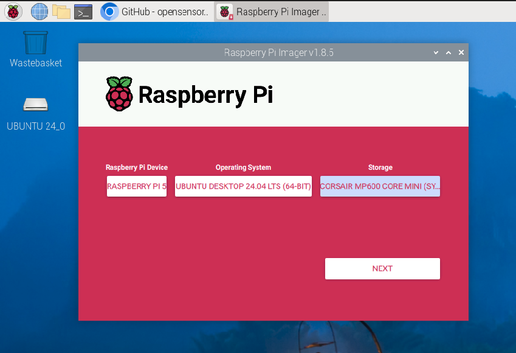

# rpi5-resources
Repository for resources and tutorials to support Raspberry Pi 5, with an emphasis on AI & cameras.

# Introduction

I started this repository to document the steps and processes to utilize Hailo 8L module on Ubuntu 24.04.

First, a bit about my setup:  I am using the Pimoroni Base Duo which gives me 2 M2 slots on a baseplate mounted under the Raspberry Pi 5.  I have a 1TB NVMe SSD in one slot and the Hailo 8L in the other.

## Hardware Setup

More instructions/documentation to be written about setting up the hardware.    

If you want to support this project and need an enclosure for your Pi5 + Pimoroni NVMe Duo base, consider purchasing my design:  https://www.printables.com/model/924964-enclosure-rpi-5-pimoroni-nvme-duo-base

Don't have a 3D printer but like my design?   I can print you one and ship it for a nominal fee--just contact via www.opensensor.io

## Storage Configuration & Installation

Install a bootable SD card in the slot of the Raspberry Pi 5 **before** installing the NVMe Duo baseplate and PCIe cable.
This is important because you'll want a fallback mechanism in case the OS does not boot; additionally you will use this OS to update the firmware before your Pi 5 can boot from an M2 SSD.

### Updating to Latest Firmware

Boot from your SD Card and follow these steps. 

1. First, ensure that your Raspberry Pi SD Card runs the latest software. Run the following command to update:

    ```console
    $ sudo apt update && sudo apt full-upgrade
    ```

2. Next, ensure that your Raspberry Pi firmware is up-to-date.  Run the following command to see what firmware you're running:

    ```console
    $ sudo rpi-eeprom-update
    ```

   You must see 6 December 2023 or a later date, but definitely upgrade to the latest during setup:

    ```console
    $ sudo raspi-config
    ```

   Under `Advanced Options` > `Bootloader Version`, choose `Latest`. Then, exit `raspi-config` with `Finish` or the *Escape* key.

   Run the following command to update your firmware to the latest version:

    ```console
    $ sudo rpi-eeprom-update -a
    ```

   Then, reboot with `sudo reboot`.

## Install Ubuntu 24.04

Utilize the Raspberry Pi Imager to install Ubuntu 24.04 on your NVMe SSD.  From your booted Raspbian OS SD card, click on the Raspberry Pi icon in the upper left corner, then `Accessories` > `Raspberry Pi Imager`.  Choose `Ubuntu` > `Ubuntu 24.04 Desktop (64-bit)`, then select your NVMe SSD as the target.  Click `Next` to write the image and wait for the process to complete.



