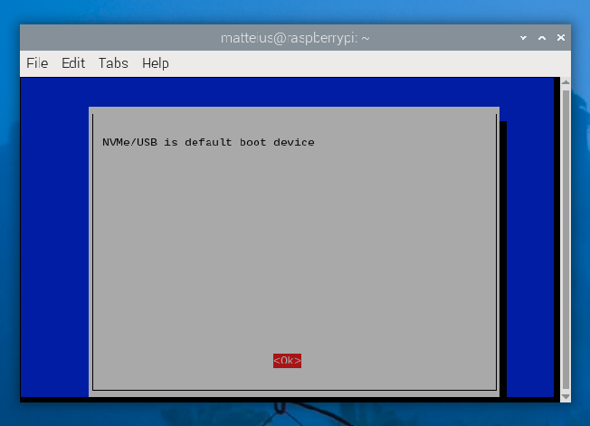

# rpi5-resources
Repository for resources and tutorials to support Raspberry Pi 5, with an emphasis on AI & cameras.

# Introduction

I started this repository to document the steps and processes to utilize Hailo 8L module on Ubuntu 24.04.

First, a bit about my setup:  I am using the Pimoroni Base Duo which gives me 2 M2 slots on a baseplate mounted under the Raspberry Pi 5.  I have a 1TB NVMe SSD in one slot and the Hailo 8L in the other.

## Hardware Setup

More instructions/documentation to be written about setting up the hardware.    Right now this guide assumes you have already installed the Pimoroni NVMe Duo baseplate.
It is recommended to install both the NVMe SSD and the Hailo 8L at the same time to avoid having to disassemble the baseplate multiple times.

If you want to support this project and need an enclosure for your Pi5 + Pimoroni NVMe Duo base, consider purchasing my design:  https://www.printables.com/model/924964-enclosure-rpi-5-pimoroni-nvme-duo-base

Don't have a 3D printer but like my design?   I can print you one and ship it for a nominal fee--just contact via www.opensensor.io

## Storage Configuration & Installation

Install a bootable SD card in the slot of the Raspberry Pi 5 **before** installing the NVMe Duo baseplate and PCIe cable.
This is important because you'll want a fallback mechanism in case the OS does not boot; additionally you will use this OS to update the firmware before your Pi 5 can boot from an M2 SSD.

### Updating to Latest Firmware

Boot from your SD Card and follow these steps. 

1. First, ensure that your Raspberry Pi SD Card runs the latest software. Run the following command to update:

    ```console
    sudo apt update && sudo apt full-upgrade
    ```

2. Next, ensure that your Raspberry Pi firmware is up-to-date.  Run the following command to see what firmware you're running:

    ```console
    sudo rpi-eeprom-update
    ```
   
   You must see 6 December 2023 or a later date, but definitely upgrade to the latest during setup:
   
    ```console
    sudo raspi-config
    ```
   
   Under `Advanced Options` > `Bootloader Version`, choose `Latest`. Then, exit `raspi-config` with `Finish` or the *Escape* key.
   
   Run the following command to update your firmware to the latest version:
   
    ```console
    sudo rpi-eeprom-update -a
    ```
   
   Then, reboot with `sudo reboot`.

## Install Ubuntu 24.04

Utilize the Raspberry Pi Imager to install Ubuntu 24.04 on your NVMe SSD.  From your booted Raspbian OS SD card, click on the Raspberry Pi icon in the upper left corner, then `Accessories` > `Raspberry Pi Imager`.  Choose `Ubuntu` > `Ubuntu 24.04 Desktop (64-bit)`, then select your NVMe SSD as the target.  Click `Next` to write the image and wait for the process to complete.


### Boot from NVMe SSD

After the Raspberry Pi Imager has completed writing the image to your NVMe SSD, yuu need to configure the Raspberry Pi 5 to boot from the NVMe SSD.

 ```console
 $ sudo raspi-config
 Select `Advanced Options` > `Boot Order` > `NVMe/USB Boot` > `Yes`
 ```



Now shut down your Raspberry Pi 5 and remove the SD card.  Install the NVMe SSD in the Pimoroni NVMe Duo baseplate and connect the PCIe cable to the Raspberry Pi 5.  Power on the Raspberry Pi 5 and you should boot into the Ubuntu 24.04 installer.

**Note:**  There is a sporadic bug affecting the Ubuntu installer for the Raspberry Pi 5.   If the media installation fails, and kicks you to a login prompt that has no valid username/pw, then you will need to try again.  This is a known issue and is being worked on by the Ubuntu team.  If you encounter this issue, completely power off and unplug the device; disconnect the PCIe ribbon cable from the pi and reconnect power.   
It should now boot from the sdcard; change the boot order back to sdcard in raspi-config, then power off and reconnect the PCIe cable.  It may take a few tries to get a successful installation.  It took me three tries on my first Raspberry Pi 5 and at the time of writing it took two tries on this second board.

Once you are able to successfully boot Ubuntu 24.04 from the NVMe SSD, you can proceed with additional software installations to support your efforts.

### Apt Update & Upgrade

Run the following commands to update and upgrade your Ubuntu 24.04 installation:

 ```console
 sudo apt update
 sudo apt full-upgrade
 ```

### Prerequisite Software Packages

```console
 sudo apt install git build-essential cmake 
```

Install also the Linux headers for your kernel version:

```console
 sudo apt install linux-headers-$(uname -r)
```


# Hailo 8L Installation

The Hailo 8L is a PCIe add on card that provides an integer based neural network AI accelerator for your Raspberry Pi 5.  The Hailo 8L is a PCIe Gen 2 x1 card that is compatible with the Raspberry Pi 5.  While official Haiol 8L support targets Raspberry Pi OS, it is possible to install and utilize the Hailo 8L on Ubuntu 24.04 as well.

## HailoRT Driver Installation

HailoRT PCIe driver sources can be cloned from GitHub using:
    
```console
 git clone https://github.com/hailo-ai/hailort-drivers.git
```
To compile and install the driver, run the following commands from the driver source path:
```console
 cd hailort-drivers/linux/pcie
 make all CFLAGS="-DHAILO_RASBERRY_PIE"
 sudo make install
```

 Load the driver: this needs to be done once, and after installation the driver will be loaded automatically on boot.
```console
 sudo modprobe hailo_pci
```
After installation, change back to the root `hailort-drivers` directory and run the following:
```console
 ./download_firmware.sh
  sudo mkdir /lib/firmware/hailo
  sudo mv hailo8_fw.4.17.1.bin /lib/firmware/hailo/hailo8_fw.bin
  sudo cp ./linux/pcie/51-hailo-udev.rules /etc/udev/rules.d/
  sudo udevadm control --reload-rules && sudo udevadm trigger
```

Note:  The `download_firmware.sh` script will download the latest firmware from the Hailo website.  If they publish a newer firmware version, you will need to update the `cp` command above to place it in the `/lib/firmware/hailo` directory.

Now is a good time to reboot the system to ensure the driver is loaded and the firmware is available.

```console
 sudo reboot
```

After reboot, you can verify the driver is loaded by running the following command:

```console
 lsmod | grep hailo
```

You should see output similar to the following:

```console
 hailo_pci             90112  0
```

Now check `dmesg` for any errors:

```console
 dmesg | grep hailo
```
You should see output similar to:
```log
[    3.712137] hailo_pci: loading out-of-tree module taints kernel.
[    3.712150] hailo_pci: module verification failed: signature and/or required key missing - tainting kernel
[    3.738221] hailo: Init module. driver version 4.17.1
[    3.738336] hailo 0000:03:00.0: Probing on: 1e60:2864...
[    3.738341] hailo 0000:03:00.0: Probing: Allocate memory for device extension, 11600
[    3.738352] hailo 0000:03:00.0: enabling device (0000 -> 0002)
[    3.738361] hailo 0000:03:00.0: Probing: Device enabled
[    3.738377] hailo 0000:03:00.0: Probing: mapped bar 0 - 00000000a885a668 16384
[    3.738381] hailo 0000:03:00.0: Probing: mapped bar 2 - 000000004c612a24 4096
[    3.738385] hailo 0000:03:00.0: Probing: mapped bar 4 - 00000000375a56e7 16384
[    3.738390] hailo 0000:03:00.0: Probing: Setting max_desc_page_size to 4096, (page_size=4096)
[    3.738398] hailo 0000:03:00.0: Probing: Enabled 64 bit dma
[    3.738561] hailo 0000:03:00.0: Probing: Using userspace allocated vdma buffers
[    3.738569] hailo 0000:03:00.0: Disabling ASPM L0s 
[    3.738574] hailo 0000:03:00.0: Successfully disabled ASPM L0s 
[    3.766048] UBSAN: array-index-out-of-bounds in /home/matteius/Projects/hailort-drivers/linux/pcie/../../common/pcie_common.c:351:53
[    3.766086]  hailo_pcie_write_firmware+0x260/0x280 [hailo_pci]
[    3.766103]  hailo_pcie_probe+0x970/0xd98 [hailo_pci]
[    3.766136]  hailo_pcie_module_init+0x98/0xff8 [hailo_pci]
[    4.040998] hailo 0000:03:00.0: Firmware was loaded successfully
[    4.061876] hailo 0000:03:00.0: Probing: Added board 1e60-2864, /dev/hailo0
```

# HailoRT Installation

Using HailoRT with other Linux distributions is possible via source compilation. On Ubuntu, it is even sometimes useful to compile from sources, for example in order to keep ABI integrity. HailoRT sources can be cloned from GitHub using:

```console
 git clone https://github.com/hailo-ai/hailort.git
```

Compiling the sources is done with the following command:

```console
 cmake -H. -Bbuild -DCMAKE_BUILD_TYPE=Release && cmake --build build --config release
```

The compilation will create two artifacts:

 Binary called hailortcli located in `build/hailort/hailortcli/`

 Library called libhailort.so.<version> located in `build/hailort/libhailort/src/`


